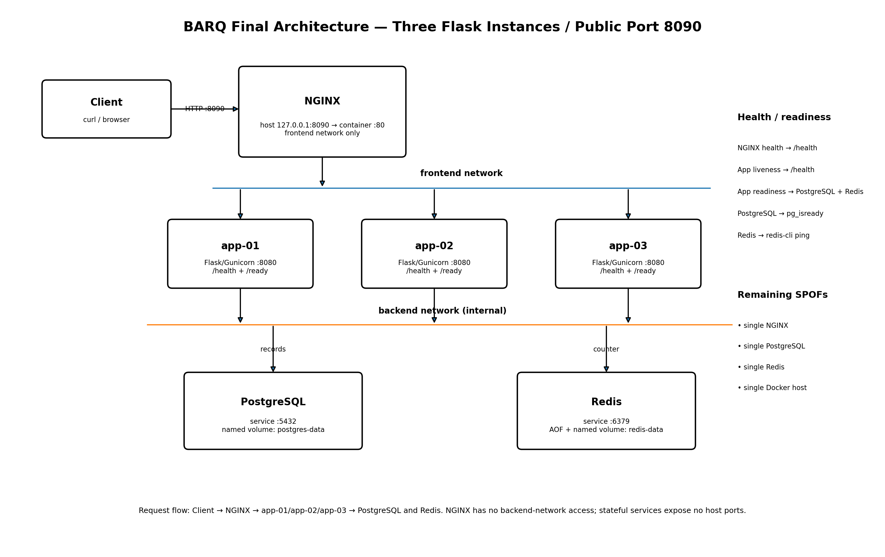

# Final architecture

The required final diagram is stored at the repository root as:

`architecture.png`

## Request flow

The final request path is:

Client -> `127.0.0.1:8090` -> NGINX `:80`
-> `app-01` / `app-02` / `app-03` on `:8080`.

NGINX and all three Flask containers use the `frontend` network.

NGINX is intentionally not connected to the backend network.

All three Flask containers also use the internal `backend` network and reach:

- PostgreSQL by service name on port 5432;
- Redis by service name on port 6379.

PostgreSQL and Redis publish no host ports.

## Persistence

PostgreSQL uses the named `postgres-data` volume.

Redis uses AOF persistence and the named `redis-data` volume.

## Health and readiness

- NGINX health checks the proxied `/health` endpoint.
- Flask `/health` represents process liveness.
- Flask `/ready` checks both PostgreSQL and Redis.
- PostgreSQL uses `pg_isready`.
- Redis uses `redis-cli ping`.

## Remaining single points of failure

The three Flask instances provide application-tier redundancy, but this Compose
assessment still has single NGINX, PostgreSQL, Redis and Docker-host instances.

A production architecture would use redundant ingress, database/cache replication or
failover, multiple worker nodes, centralized monitoring, managed secrets and tested
off-host backups.
